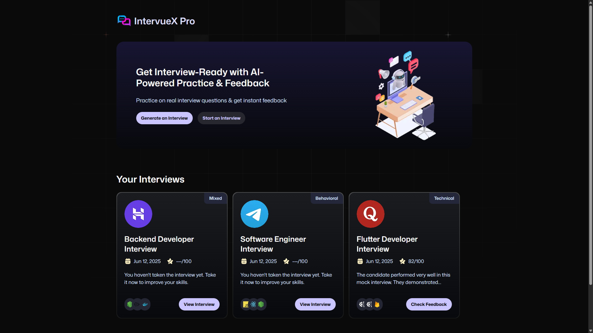

# 🚀 IntervueX Pro

[](https://nextjs.org/)
[](https://firebase.google.com/)
[](https://vapi.ai)

> **IntervueX Pro** – Your personal AI-powered mock interview assistant.

---

## 🌟 Overview

**IntervueX Pro** is an advanced, full-stack mock interview platform where users can practice interviews tailored to their role, tech stack, and experience level. It features a voice-based **AI interviewer**, powered by **Vapi Workflows**, and a slick UI built with **Next.js** and **Tailwind CSS**.

### 🔗 Live Now : [https://intervuexpro.vercel.app](https://intervuexpro.vercel.app)

---

## 🎥 Demo

<p align="center">
  
</p>

---

## 🔑 Features

- 🎤 **AI Agent**: Voice-enabled interview sessions powered by Vapi Workflows
- 🎯 **Role-Based Setup**: Choose roles like Backend Developer, Product Manager, and more
- ⚙️ **Tech Stack Customization**: Pick technologies to tailor the questions (e.g., Node.js, MongoDB)
- 🧠 **Behavioral / Technical Questions**: Choose interview type
- 📋 **Interview History**: Save and review past sessions
- 🔐 **Auth with Firebase**: Secure login and profile
- 🎨 **Fully Responsive**: Works great on mobile and desktop
- 🚀 **Deployed on Vercel**

---

## 🛠️ Tech Stack

| Area         | Technology                          |
|--------------|--------------------------------------|
| Frontend     | Next.js 14 + App Router              |
| Styling      | Tailwind CSS                         |
| Backend      | Firebase Firestore + Firebase Auth   |
| AI Layer     | Vapi Workflows + OpenAI              |
| Deployment   | Vercel                               |

---

## 📦 Installation

### 1. Clone the repo

```bash
git clone https://github.com/AkshayGojiya/ai_interview_platform.git
cd intervuex-pro
```
### 2. Install dependencies

```bash
npm install
```
### 3. Set up .env.local

```bash
NEXT_PUBLIC_FIREBASE_API_KEY=your_key
NEXT_PUBLIC_FIREBASE_AUTH_DOMAIN=your_project.firebaseapp.com
NEXT_PUBLIC_FIREBASE_PROJECT_ID=your_project_id
NEXT_PUBLIC_FIREBASE_STORAGE_BUCKET=your_project.appspot.com
NEXT_PUBLIC_FIREBASE_MESSAGING_SENDER_ID=your_sender_id
NEXT_PUBLIC_FIREBASE_APP_ID=your_app_id

NEXT_PUBLIC_VAPI_API_KEY=your_vapi_api_key
NEXT_PUBLIC_VAPI_WORKFLOW_ID=your_vapi_workflow_id
```
### 4. Start local dev server

```bash
npm run dev
```
